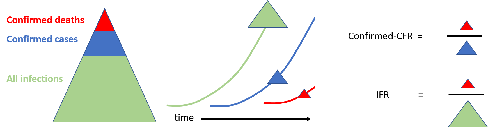
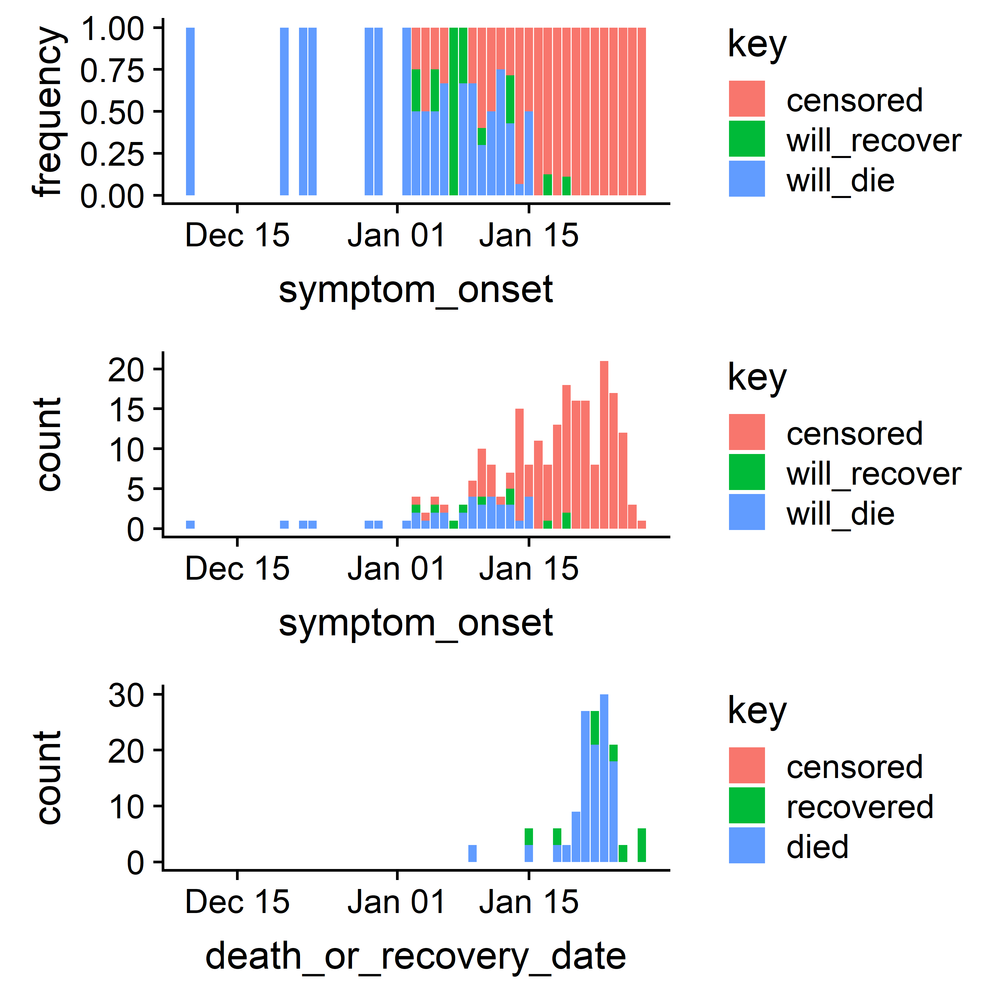
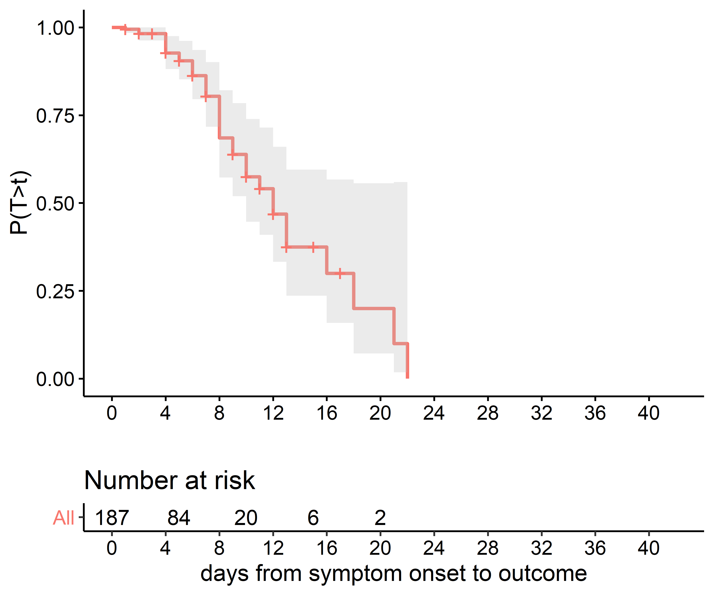
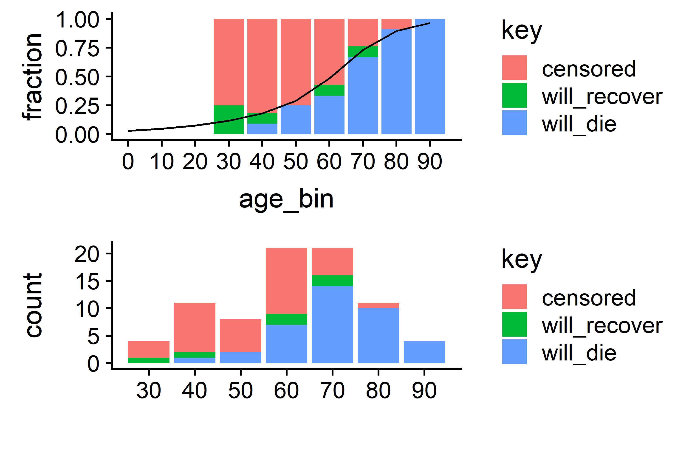
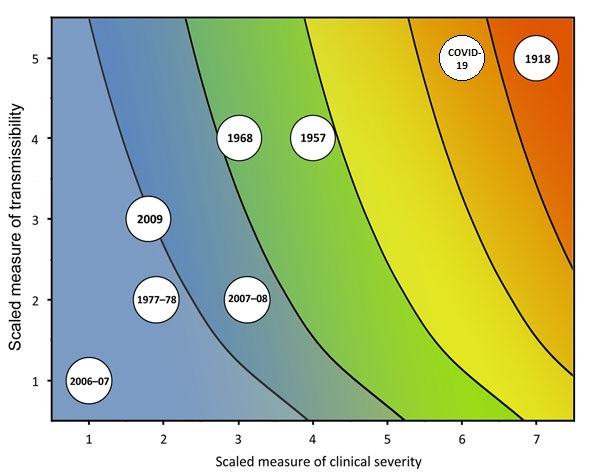
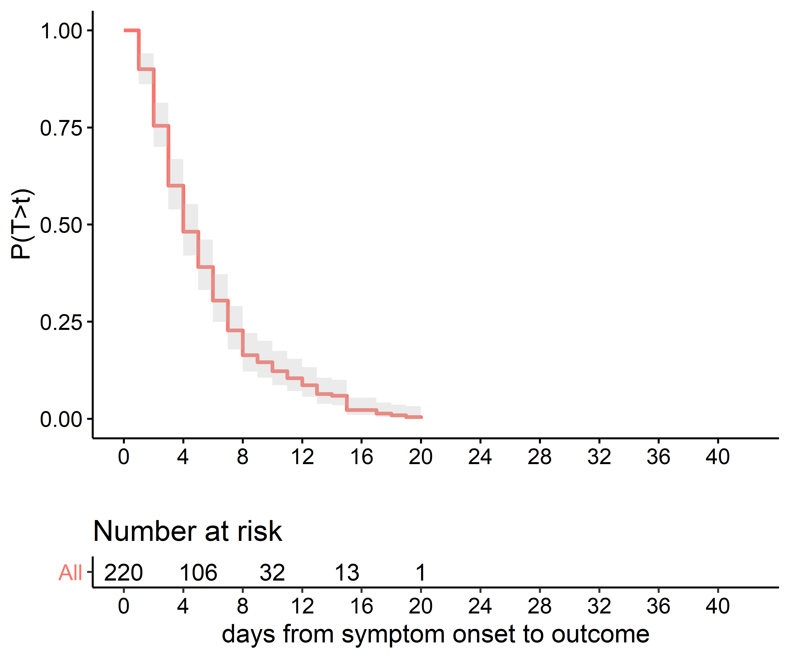
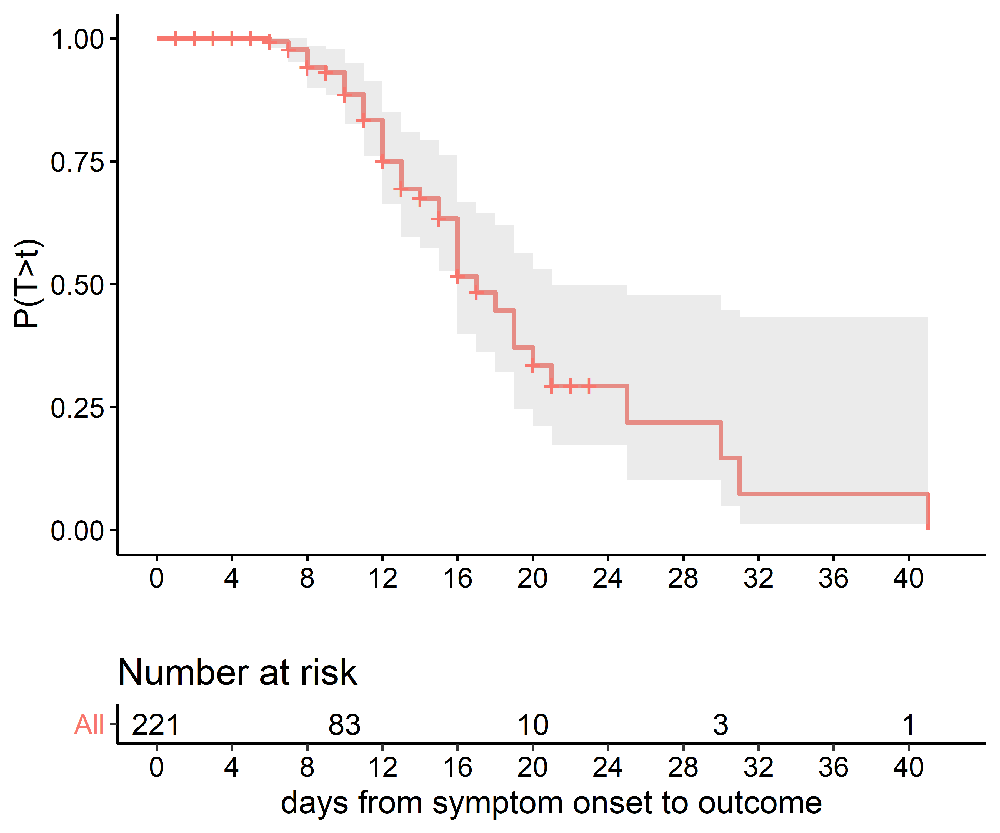
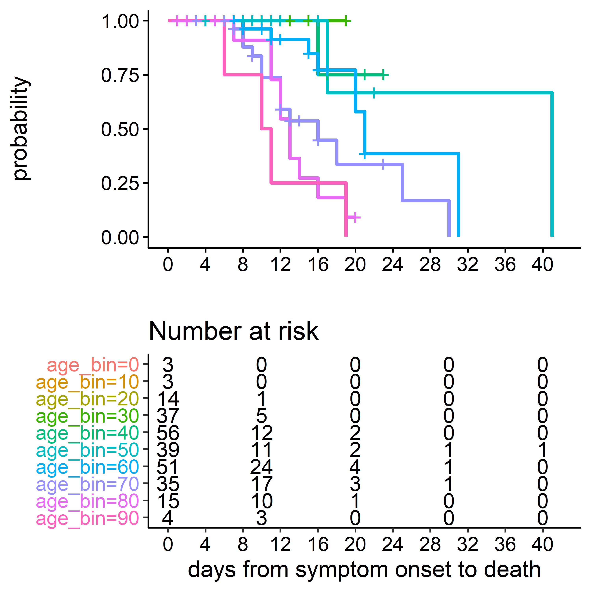

# Recap of substantive revision on 18 February 2020

On February 16, following the submission of results from an earlier version of this report to the [MIDAS-network COVID-19 GitHub repo](https://github.com/midas-network/COVID-19), I (Mike Famulare) received an email from Neil Ferguson who kindly pointed out a technical error in the published estimate of the overall infection-fatality-ratio (IFR). Despite the attention paid to adjusting for delays in outcomes, I neglected to adjust the estimate of the case-ascertainment rate--the fraction of all infections reported as cases--for the delays from infection onset to symptom onset and case confirmation.  **With this additional adjustment and using the same methodology and data from the original report from prior to January 31, the corrected estimate of the infection-fatality-ratio (IFR) is 0.94 (0.37, 2.9) percent.**  While the uncertainty remains large, this estimate now [excludes CDC's reference estimate for the 1957 H2N2 pandemic flu (0.1 to 0.3 percent) and is now consistent with CDC's reference estimate of 2.04 percent for the 1918 H1N1 pandemic flu](file:///C:/Users/mfamulare/Downloads/12-0124-TECHAPP1%20(3).pdf). Our estimate is also now completely compatible with the [independent estimate published by the Imperial College group on February 10](https://www.imperial.ac.uk/media/imperial-college/medicine/sph/ide/gida-fellowships/Imperial-College-2019-nCoV-severity-10-02-2020.pdf). While the inference that COVID-19 is exhibiting historic severity and transmissibility in the absence of effective interventions is unchanged, the shift in framing brought about by this three-fold revision from "comparable to the 1957 flu but not 1918" to "possibly comparable to 1918", albeit ignoring differences in age distribution, feels significant.

The document below has been edited from previous versions to correct the technical issue decribed above. Unless noted, the results reflect the state of data and interpretation as of February 4 and are otherwise unchanged.  Please seek more recent sources for updates in response to new data. 

# Summary

In recent days, much clarity has been gained about the transmissibility of 2019-nCoV--that people may be infectious while [exhibiting no](https://www.nejm.org/doi/full/10.1056/NEJMc2001468?query=featured_coronavirus) or [mild](https://www.sciencemag.org/news/2020/02/paper-non-symptomatic-patient-transmitting-coronavirus-wrong) symptoms, that [some shedders can display very high viral load](https://www.nejm.org/doi/full/10.1056/NEJMoa2001191?query=featured_coronavirus), and that [R0 in China prior to interventions is likely around 2.5 to 2.9](https://www.thelancet.com/journals/lancet/article/PIIS0140-6736(20)30260-9/fulltext).  However, to fully anticipate the possible  epidemiological impact of this pathogen, more clarity is needed around the confirmed-case-fatality-ratio (confirmed-CFR -- fraction of confirmed cases that result in death) and infection-fatality-ratio (IFR -- fraction of all infections that result in death).  Early crude estimates of the confirmed-CFR based on the ratio of confirmed cases to reported deaths are hovering around 2-3 percent, but this naive calculation is incorrect because it does not account for the time required from symptom onset, case confirmation, and death.  This report uses publicly-available data through January 31, 2020 and published modeling results to estimate the confirmed-CFR and IFR, adjusted for age and delays between case confirmation and death. With this information about mortality and estimates by others about transmissibility, we conclude with a preliminary assessment of the epidemiologial risk posed by 2019-nCoV relative to seasonal and pandemic influenza.

Based on publicly-curated linelist data that has thorough case data through only January 15, the early evidence is that the confirmed-CFR has strong age structure, with highest risk of death in the elderly.  Averaging over all confirmed case ages, the estimated overall confirmed-CFR was approximately 33 (29, 37) percent.  This estimate, which is only well grounded in data through January 15, is roughly 10 times higher than the incorrect naive calculation mentioned above. With expanded diagnostic capacity and more sensitive case definitions, it is reasonable to expect this number will trend downward over time and we will update as more data becomes available. 

(*Paragraph revised 18 Feb*.) The confirmed-CFR only describes cases that were confirmed, publicly reported, and summarized in a manner suitable for analysis. From the confirmed case data and the most recent mathematical transmission model published in [the Lancet by We et al](https://www.thelancet.com/journals/lancet/article/PIIS0140-6736(20)30260-9/fulltext), we estimate that only 2.9 (1.3, 8.0) percent of infections had been reported as confirmed cases through January 25.  Under the assumption that most infections that have gone unreported are not severe, **the analyzed evidence indicates that the likely overall infection-fatality-ratio (IFR) is roughly 9.4 per 1000 (4.0, 26)**, ~~roughly comparable to [the 1957 H2N2 pandemic flu](https://wwwnc.cdc.gov/eid/article/19/1/12-0124_article)~~ more severe than the 1957 H2N2 influenza pandemic and consistent with mortality estimates from [the 1918 H1N1 influenza pandemic ](https://wwwnc.cdc.gov/eid/article/19/1/12-0124_article), albeit with broad uncertainty.  

From the early data, we estimated that the median time from hospitalization to death is 12.4 days, compatible with a recent publication in [NEJM by Li et al](https://www.nejm.org/doi/full/10.1056/NEJMoa2001316?query=featured_coronavirus) using data from within China.  However, from approximately Jan 13 through Jan 30, the official death count accumulated more quickly than can be explained by the confirmed case timeseries, the confirmed-CFR above, and the observed median duration to death. To reconcile the official death count with the confirmed case count, we find the most parsimonious explanation is that the median duration from hospitalization to death has dropped from 12.4 days to approximately 7 days since Jan 12.  Summarizing the evidence we have so far on the progression from confirmed case to confirmed-case-fatality, a simple model to predict deaths from confirmed cases is to multiply confirmed cases by 0.33 and shift forward in time by 7 days. If correct, we expect the outbreak to reach 1000 cumulative deaths in the next week. (*Added 18 Feb: The number of reported eaths excedded 1000 on Feb 10, five days after the point estimate herein.*) The continued reliability of this model will depend on stable data reporting, the age distribution of confirmed cases, the effectiveness of hospital care, all of which may change over time and by location.  

(*Paragraph revised 18 Feb*.) With combined evidence about transmissibility and severity, as viewed through CDC's [Novel Framework for Assessing Epidemiologic Effects of Influenza Epidemics and Pandemics (Reed et al 2013)](https://wwwnc.cdc.gov/eid/article/19/1/12-0124_article), evidence to date points toward 2019-nCoV having the potential to ~~be the second-most-severe respiratory pathogen pandemic in the last century~~ have comparable severity as the 1918 flu pandemic in the absence of effective control and treatment, when averaged across all ages. 

Please note that all results summarized above are based on data and nascent transmission modeling from roughly the first month of the outbreak. Furthermore, the IFR and confirmed-CFR in cities and countries outside the current epidemic foci will depend on age-pyramids, distribution of comorbidities, access to care, and diagnostic capabilities, and transmissibility will depend on population structure, behavior, and effectiveness of interventions. **All estimates and assessments are preliminary. We are providing them to guide decision making in the absence of better information, and they will continue to be revised or be superceded by the work of others as evidence warrants.** 

This analysis is made possible by the willingness of Chinese public health authorities to broadcast valuable information, the dedicated efforts of many volunteers to curate data in real-time, and rapid publication by experts working closely with patients and authorities.  The spirit of open science around this outbreak is remarkable and is a great benefit to those preparing around the world. 

# Schematic relationships between all infections, confirmed cases, confirmed deaths, and time. 
Figure 1 shows the schematic relationships between different measures of disease incidence and severity. Early in an outbreak, it is difficult to directly estimate the case-fatality-ratio among confirmed cases (confirmed-CFR) from cumulative case data because natural disease progression takes time and so deaths are delayed relative to cases. It is also more difficult to estimate fatality ratio among all infection (the infection-fatality-ration, IFR) because the true number of infections is not directly measurable. In this report, we use a small amount of linelist data with complete disease progression information from early in the outbreak to estimate the delays between case confirmation and death, and then the time and age-adjusted confirmed-CFR.  With an estimmate of the true confirmed-CFR in hand, we look to incidence models to estimate the fraction of infections that are reported as confirmed cases, and thus estimate the IFR in the whole infected population. 

# Methods

**Data.** To characterize the case-fatality ratio among confirmed cases--the confirmed-case-fatality-ration (confirmed-CFR)--we analyzed case report data recored in the ["Kudos to DXY.cn linelist"](https://docs.google.com/spreadsheets/d/1jS24DjSPVWa4iuxuD4OAXrE3QeI8c9BC1hSlqr-NMiU/edit#gid=1187587451) as of the Jan 27 update.  For cases who died or recovered, we went back to the original media links and added columns to capture date of death or hospital discharge.  The augmented dataset is available [on github](https://github.com/InstituteforDiseaseModeling/nCoV-public/blob/master/data/Kudos%20to%20DXY.cn%20Last%20update_%2001_27_2020%2C%20%209_00%20pm%20(EST)%20-%20Line-list.csv) and we've contacted the linelist maintainer to incorporate. The dataset appears to overlap with the recent publication in [the Lancet by Chen et al](https://www.thelancet.com/journals/lancet/article/PIIS0140-6736(20)30211-7/fulltext) and [NEJM by Li et al](https://www.nejm.org/doi/full/10.1056/NEJMoa2001316?query=featured_coronavirus) but we haven't yet checked in detail. Of 275 cases listed, age is reported for 257. The final outcome of death is known for 39 and recovery for 13.  The outcomes are missing for the remaining 223 and we assume they are right-censored in the analyses below.  For recovered cases, the recovery date is defined as the date released from hospitalization.

To examine changes in the age distribution of confirmed cases after Jan 17 -- when reporting rates appear to have increased -- we analyzed the additional age data in the [more comprehensive nCoV2019_2020_line_list_open linelist](https://docs.google.com/spreadsheets/d/1itaohdPiAeniCXNlntNztZ_oRvjh0HsGuJXUJWET008/edit#gid=429276722) as of the morning of Jan 30, for a total of 318 cases with known age and 4984 with unknown. 

Both linelists are lacking most outcome information and are lagging authoritative case reports from [DXY.cn](https://3g.dxy.cn/newh5/view/pneumonia?from=timeline&isappinstalled=0).  For the cumulative confirmed case and reported death timeseries, we used DXY.cn data aggregated at [Wikipedia: Timeline_of_the_2019-2020_Wuhan_coronavirus_outbreak](https://en.wikipedia.org/wiki/Timeline_of_the_2019%E2%80%9320_Wuhan_coronavirus_outbreak) and [made available on Github](https://github.com/InstituteforDiseaseModeling/nCoV-public/blob/Mike/data/cumulative_data_wikipedia.csv).

Instead of traditional citation endnotes, all sources are cross-referenced with hyperlinks embedded in the text.

**Methods.**  The Kaplan-Meier estimator was used to characterize the distribution of times from symptom onset to death. When final outcomes are missing (death or recovered), we assume the outcomes are right-censored--not yet known and/or lost to follow-up.   To estimate the case-fatality-rates by age, we used logistic regression with a generalized additive model to smooth raw observations and extrapolate to younger ages not yet included in the dataset.  

**Definitions.** Confirmed cases: confirmed positive by PCR. Confirmed-case-fatality-ratio (confirmed-CFR): expected fraction of confirmed cases that will die.  Infection-fatality-ratio (IFR): estimated fraction of all infections (confirmed and suspected and unreported) that will die. 

# Results

## Duration from symptom onset to death or recovery from confirmed cases.
We analyzed publicly-curated data describing the time from symptom onset to death or recovery (marked by release from hospitalization) taken from the ["Kudos to DXY.cn linelist"](https://docs.google.com/spreadsheets/d/1jS24DjSPVWa4iuxuD4OAXrE3QeI8c9BC1hSlqr-NMiU/edit#gid=1187587451) as described in the Methods above. Figure 2 describes the time series of symptom onset and death, recovery, or right-censoring (unknown or as-yet-determined outcome). The two most relevant features of this data are (1) outcomes are mostly unknown for cases with onset after January 15, and (2) deaths and recoveries lag symptom onset.

{width=5in}

## Duration from hospitalization to death from confirmed cases prior to Jan 15

Figure 3 shows the disribution of durations from hospitalization to death for confirmed cases prior to Jan 15. We find the median time from hospitalization to death in the population studied is 12.4 days. This is consistent with results from [Li et al in NEJM](https://www.nejm.org/doi/full/10.1056/NEJMoa2001316?query=featured_coronavirus) report that the mean time from symptom onset to hospitalization was 12.5 days in cases before Jan 1.   

{width=5in}

## Estimated confirmed-case-fatality-ratios by age prior to Jan 15
Figure 4 shows the fraction with each outcome by age, drawn only from the cases before Jan 15 for which most have complete data. To put a lower bound on the confirmed-case-fatality-ratio (confirmed-CFR) for this first month of cases, we assume the censored cases, almost all of whom are outside Hubei, will eventually recover, and the model shown extrapolates the confirmed-CFR to younger ages based on that assumption. 

{width=5in}

### Limited evidence for a shifting age distribution in confirmed cases
At the time this work was performed, the [more comprehensive nCoV2019_2020_line_list_open linelist](https://docs.google.com/spreadsheets/d/1itaohdPiAeniCXNlntNztZ_oRvjh0HsGuJXUJWET008/edit#gid=429276722) incorporates most of the confirmed cases through January 30, and a small number of them include age information not available for the analyses above.  Coincident with a sharp rise in confirmed cases after January 17, likely associated with expanded availability of molecular diagnostics, the age distribution of confirmed cases shifts downward. Prior to Jan 17, the mean age was roughly 65 years, and after it was roughly 50 years, as shown in Figure 5.

{width=5in}

## Estimated overall confirmed-case-fatality-ratio and infection-fatality-ratio
Given the age distribution of cases described Figure 4, and the confirmed-CFR by age described in the top panel of Figure 3, we calculated the confirmed-CFR averaged over the age of cases. We estimate that the total confirmed-CFR for cases confirmed before January 31 will be approximately 33 (29, 37) percent. The confirmed-CFR only describes cases that have tested positive for 2019-nCoV by PCR and have been publicly reported. Thus the confirmed-CFR is specific to a health system at a time and place and does not describe the expected mortality rate in the entire infected population, observed or not.  

(*Paragraph revised 18 Feb*.) To estimate the overall infection-fatality-ratio (IFR), we turn to modeling to infer the total infection count and thus the true denominator. Alongside [761 confirmed cases in Wuhan as of January 25](https://www.cnn.com/asia/live-news/coronavirus-outbreak-hnk-intl-01-25-20/index.html), [Wu et al ](https://www.thelancet.com/journals/lancet/article/PIIS0140-6736(20)30260-9/fulltext) estimated that 75815 (37304, 130330) cumulative infections had occured in Wuhan through that time, with the infection count doubling every 6.4 (5.8, 7.1) days. However, many of these infections have not had time to be become symptomatic, be tested, and confirmed, and thus cannot contribute to the case count. Working backward from the Wu et al estimate, and assuming that the [incubation period from exposure to symptom onset is 5.4 (4.2, 6.7) days](https://institutefordiseasemodeling.github.io/nCoV-public/analyses/individual_dynamics_estimates/nCoV_incubation_period.html) and that it took a further [4.25 (3.8, 4.7) days from symptom onset to case confirmation in the dataset analyzed here](#Supplemental-results), we infer that only 26650 (9460, 59400) cumulative infections in Wuhan were eligible to be reported as cases. The ratio of reported cases to reporting-eligible infections gives us an ascertainment rate for this time period of 2.9 (1.3, 8.0) percent. Under the assumption that most reporting-eligible infections that went unreported are not severe and will not progress to death, current evidence indicates that the likely overall infection-fatality-ratio (IFR) is roughly 9.4 (3.7, 29.5) per 1000 (or 0.94 (0.37, 2.9) percent).   

## Modeling cumulative deaths relative to cumulative cases
The discrepancy between the inferred confirmed-CFR of 33 percent and the approximately 3 percent one gets from the naive calculation that takes the number of deaths over the number of cases is due to the observation in Figure 2 that it takes time for cases to die. To show this in action, we combined a model of the time between hospitalization or confirmation (whichever was available) with the timeseries of confirmed cases and the observed age distribution to test our ability to predict the reported cumulative deaths from the reported cumulative cases.  

In Figure 6, we show the cumulative confirmed cases from the [nCoV2019_2020_line_list_open linelist](https://docs.google.com/spreadsheets/d/1itaohdPiAeniCXNlntNztZ_oRvjh0HsGuJXUJWET008/edit#gid=429276722) (Figure 6, light blue) and the authoritative count curated from [DXY.cn](https://3g.dxy.cn/newh5/view/pneumonia?from=timeline&isappinstalled=0) (Figure 6, dark blue), the authoritative cumulative death count (Figure 6, dark green), and two models.  Both models assume the confirmed-CFR by age model shown in Figure 4, which again averages 33 percent mortality across all ages. The first model (Figure 6, red) assumes the time from confirmation to death is described by the curve from Figure 3, with a median of 12.4 days.  That model was able to reasonably estimate the deaths from cases hospitalized before Jan 12, but it under-estimated deaths thereafter.  The second model (Figure 6, light green) assumes that the median duration between confirmation and death shortened to 7 days after Jan 12, roughly coincident with the sharp rises in cases.  This second model better fits the authoritative death count, and predicts 1000 deaths will be crossed on Feb 5.  

![**Figure 6.** Comparing confirmed cases to confirmed and imputed deaths. The two sources of truth for the confirmed case count are shown in blue (dark blue, DXY.cn; light blue, nCoV2019_2020_line_list_open).  The authoritative death count is in dark green. The best fitting model is shown in light green; it assumes the confirmed-CFR with age from Figure 4, a 12.4 day median interval from hospitalization to for cases hospitalized on or before Jan 12, and a 7 day median interval from hospitalization to death thereafter.  The model based only on the observe confirmed-CFR by age and the 12.4 median duration is shown in red.   ](cases_vs_deaths_fancy_model.png){width=7.5in}

To confirm that the key quantities that link confirmed cases to confirmed deaths is a roughly 33% overall confirmed-CFR and a 7 day delay between hospitalization and death, we also implemented the very simple model using only the authoritative case data as shown in Figure 7 below.  This model simply takes the confirmed cases, multiplies by 0.33 and shifts the date by 7 days. We again reproduce the observed deaths reasonably well.

{width=7.5in}

These results are sensitive to the disease progression, but also the age distribution of cases, data reporting, and the effectiveness of hospital care.  We will monitor continuing data to see if this early pattern holds, and seek explanations if it does not. 

# Interpretation

(*Paragraph revised 18 Feb*.) As first noted by [researchers at Johns Hopkins University using this same data](https://github.com/HopkinsIDD/nCoV-Sandbox), 2019-nCoV appears to be exhibiting MERS-like mortality among confirmed cases, at least early on. But in contrast to MERS or SARS before it, all indirect estimates from case exportation and travel rates from Wuhan indicate that the total number of infections was roughly 35 (12, 78) times the number of reported cases perior to January 25. If most unreported infections are not severe, then the overall infection-fatality-ratio is likely roughly 10 per 1000 and comparable to that of [~~the 1957 H2N2 influenza pandemic, and roughly an order of magnitude lower than that of~~ the 1918 flu](https://wwwnc.cdc.gov/eid/article/19/1/12-0124_article). Furthermore, [R0 estimates prior to interventions are most recently in the range of 2.5 to 2.9](https://www.thelancet.com/journals/lancet/article/PIIS0140-6736(20)30260-9/fulltext), somewhat higher than [typical estimates for influenza that are usually between 1.5 and 2](https://wwwnc.cdc.gov/eid/article/19/1/12-0124-techapp1.pdf).  

(*Paragraph revised 18 Feb*.) Using CDC's [Novel Framework for Assessing Epidemiologic Effects of Influenza Epidemics and Pandemics (Reed et al 2013)](https://wwwnc.cdc.gov/eid/article/19/1/12-0124_article), evidence to date points toward 2019-nCoV having the potential to be ~~the second-most-severe~~ comparable to the most severe respiratory pandemic in the last century in the absence of effective control measures (Figure 8). Differences in mortality distribution by age and comorbities will lead to important differences in presentation, but these important questions are outside the scope of this report. 

{width=6.5in}

This early analysis is based on limited data from early in the outbreak and is thus subject to change. IFR and confirmed-CFR as the outbreak evolves in time and place will depend on age-pyramids, distribution of comorbidities, access to care, and diagnostic capabilities, and transmissibility will depend on population structure, behavior, and effectiveness of interventions.  We will update these analyses as new evidence becomes available, and we hope that we are over-estimating the infection-fatality-ratio.

# Supplemental results {#Supplemental-results}

(*Figure 9 added 18 Feb*.) Figure 9 shows the Kaplan-Meier estimate of the distibution from symptom onset to case confirmation in the [nCoV 2019-2020 linelist cached on GitHub](https://github.com/InstituteforDiseaseModeling/nCoV-public/tree/master/data).  The median time from symptom to confirmation was 4.25 (3.8, 4.7) days.  

{width=5in}

Figure 10 shows the Kaplan-Meier estimate of the distibution from symptom onset to death or recovery for all cases described above.  The mean time from symptom to death is 18 days; time to recovery is not significantly different (not shown).  

{width=5in}

Figure 11 shows the onset to death duration distribution by age. The duration from onset to death was longer for younger patients.

{width=5in}

